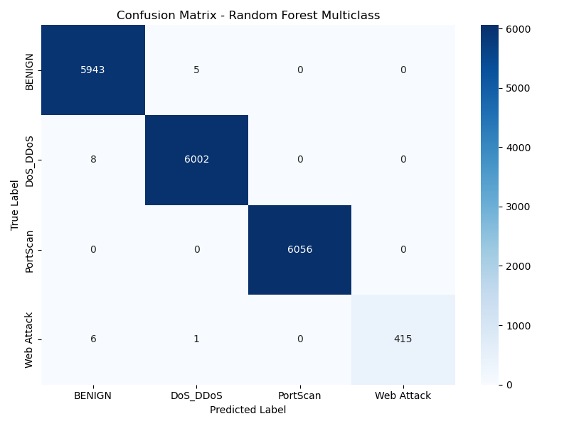
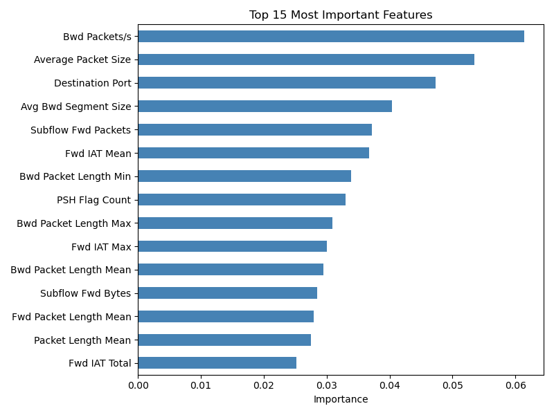

# Network Intrusion Detection System

A machine learning-based network intrusion detection system trained on the CICIDS2017 dataset.

## Overview

This project detects four types of network attacks using a Random Forest classifier:
- **DDoS / DoS** — Distributed/volumetric attacks overwhelming the target
- **PortScan** — Reconnaissance attacks scanning for open ports
- **Web Attack** — Brute force, XSS, and SQL injection attacks
- **BENIGN** — Normal network traffic

## Dataset

[CICIDS2017](https://www.unb.ca/cic/datasets/ids-2017.html) by the Canadian Institute for Cybersecurity.
- 1,373,444 total records across 4 attack scenarios
- 78 network flow features extracted by CICFlowMeter

## Results

| Class | Precision | Recall | F1-Score |
|-------|-----------|--------|----------|
| BENIGN | 1.00 | 1.00 | 1.00 |
| DoS/DDoS | 1.00 | 1.00 | 1.00 |
| PortScan | 1.00 | 1.00 | 1.00 |
| Web Attack | 1.00 | 0.98 | 0.99 |
| **Overall Accuracy** | | | **1.00** |

## Visualizations

### Confusion Matrix

Only 10 misclassifications out of 18,436 test samples. The 8 Web Attack samples 
misclassified as BENIGN represent false negatives—a critical concern in security 
applications where missing attacks is more costly than false alarms.

### Top 15 Feature Importance

The most discriminative features include backward packet rate, initial TCP window 
size, and packet length statistics—all consistent with known network attack 
signatures.

## Project Structure

| File | Description |
|------|-------------|
| `explore.py` | Data exploration and cleaning |
| `merge.py` | Merge all CSV files into combined_dataset.csv |
| `train.py` | Binary classification (DDoS vs BENIGN) |
| `train_multiclass.py` | Multiclass detection (v4, current) |

## Development Notes

Four versions of the multiclass model were developed:
- **v1** — Loaded full 1.37M records, killed by OOM
- **v2** — Used nrows=50000, caused sampling bias (PortScan: 234 samples)
- **v3** — Random sampling per file, PortScan improved to 16,577 samples
- **v4** — Read from combined dataset, Web Attack improved to 2,180 samples

## Limitations

- Web Attack has only 2,180 samples, leading to slightly lower recall (0.98)
- Future work: apply SMOTE oversampling to improve minority class performance
- Real-time packet capture integration (Scapy) is planned
