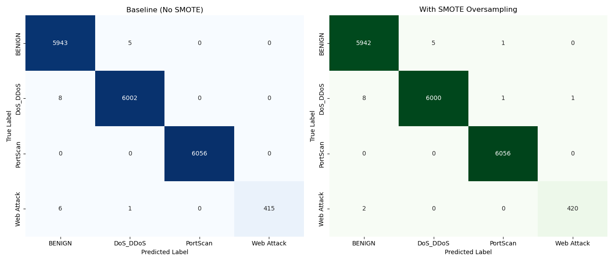
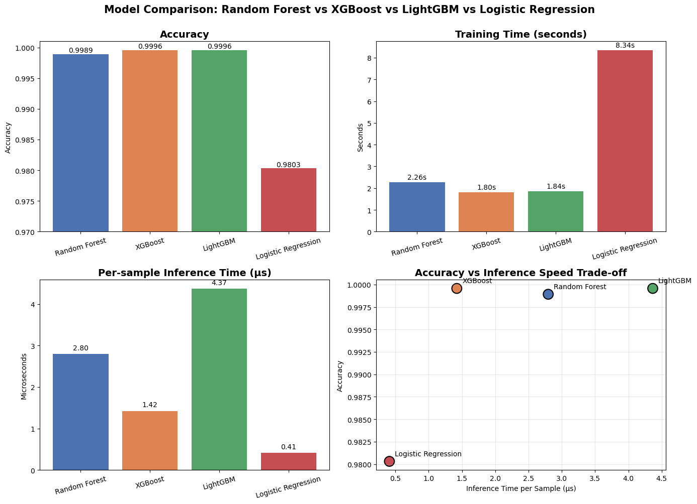

# Network Intrusion Detection System

A machine learning-based network intrusion detection system trained on the CICIDS2017 dataset, classifying network traffic into BENIGN, DoS/DDoS, PortScan, and Web Attack categories. Multiple classifiers (Random Forest, XGBoost, LightGBM, Logistic Regression) are benchmarked on accuracy and inference latency for real-time deployment feasibility.

---

## Overview

This project detects four types of network behavior:
- **BENIGN** — Normal network traffic
- **DoS / DDoS** — Distributed/volumetric attacks overwhelming the target
- **PortScan** — Reconnaissance attacks scanning for open ports
- **Web Attack** — Brute force, XSS, and SQL injection attacks

---

## Dataset

[CICIDS2017](https://www.unb.ca/cic/datasets/ids-2017.html) by the Canadian Institute for Cybersecurity.
- 1,373,444 total records across 4 attack scenarios
- 78 network flow features extracted by CICFlowMeter

See [`data/README.md`](data/README.md) for download instructions.

---

## Results

### Baseline Model (Random Forest, no resampling)

| Class | Precision | Recall | F1-Score |
|-------|-----------|--------|----------|
| BENIGN | 1.00 | 1.00 | 1.00 |
| DoS/DDoS | 1.00 | 1.00 | 1.00 |
| PortScan | 1.00 | 1.00 | 1.00 |
| Web Attack | 1.00 | 0.98 | 0.99 |
| **Overall Accuracy** | | | **1.00** |

### Feature Importance


The most discriminative features include backward packet rate, initial TCP window size, and packet length statistics—all consistent with known network attack signatures.

---

## SMOTE Analysis: A Trade-off Study

The baseline model achieves 0.98 recall on Web Attack due to severe class imbalance (only 2,180 samples vs 30,000 in other classes). To address this, **SMOTE (Synthetic Minority Over-sampling Technique)** was applied to the training set only (never to the test set, to avoid evaluation leakage).

### Confusion Matrix Comparison


### Misclassification Analysis

| | Baseline | With SMOTE | Change |
|---|---|---|---|
| Web Attack → BENIGN (false negatives) | 6 | 2 | **−4** ✓ |
| Other-class misclassifications | 13 | 16 | +3 |
| **Total misclassifications** | **20** | **19** | **−1** |

### Why this trade-off matters

In security systems, **false negatives (missed attacks) are far more costly than false positives**. A missed attack means a successful intrusion; a false alarm wastes analyst time but doesn't compromise the system.

SMOTE reduces Web Attack false negatives from 6 to 2 (a 67% reduction), at the cost of 3 additional misclassifications in other classes. For a security application, this is a **favorable trade-off**.
### Note on metric precision

Both models show 1.00 across most cells in `classification_report` because scikit-learn rounds to two decimal places. The confusion matrices reveal the actual differences that the aggregated report hides.

---

## Model Comparison

To select the best model for real-time intrusion detection, four classifiers were benchmarked on accuracy, training time, and **per-sample inference time** (critical for live packet processing).

### Comparison Results



| Model | Accuracy | Train Time | Inference per Sample |
|-------|----------|-----------|---------------------|
| Random Forest | 99.89% | 2.26s | 2.80 μs |
| **XGBoost** | **99.96%** | **1.80s** | **1.42 μs** |
| LightGBM | 99.96% | 1.84s | 4.37 μs |
| Logistic Regression | 98.03% | 8.34s | 0.41 μs |

### Key Findings

1. **XGBoost achieves the best accuracy-speed trade-off**, reaching 99.96% accuracy with the second-fastest inference time. It also achieves perfect Web Attack recall (1.00) *without* requiring SMOTE—suggesting gradient boosting handles class imbalance better than Random Forest on this dataset.

2. **Logistic Regression is fastest but least accurate**. Its 0.41 μs/sample inference is ideal for ultra-high-throughput scenarios, but the 0.88 F1 on Web Attack makes it unsuitable for security applications where missed attacks are costly.

3. **LightGBM's inference is unexpectedly slow on this dataset**. LightGBM is typically faster than XGBoost on large datasets, but here it's ~3× slower per sample. This is likely due to dataset size (~18K test samples)—LightGBM's optimizations favor large-scale data.

### Implication for Real-time Detection

At a conservative 1 Gbps network with ~100K flows/sec, XGBoost can process roughly **700,000 samples/sec**, providing significant headroom for real-time deployment. This makes XGBoost the chosen model for the upcoming Scapy integration phase.

---

## Project Structure

```
network-intrusion-detection/
├── data/
│   └── README.md                       # Dataset download instructions
├── models/
│   ├── rf_multiclass.joblib            # Baseline Random Forest model
│   ├── rf_smote.joblib                 # SMOTE-enhanced Random Forest model
│   ├── confusion_matrix.png            # Baseline confusion matrix
│   ├── confusion_matrix_comparison.png # Baseline vs SMOTE comparison
│   ├── feature_importance.png
│   ├── model_comparison.png            # 4-model benchmark visualization
│   └── model_comparison.csv            # 4-model benchmark raw data
├── src/
│   ├── compare_models.py               # Benchmark RF / XGBoost / LightGBM / LR
│   ├── explore.py                      # Data exploration and cleaning
│   ├── merge.py                        # Merge all CSV files
│   ├── train.py                        # Binary classification (DDoS vs BENIGN)
│   ├── train_multiclass.py             # Multiclass detection (baseline)
│   ├── train_smote.py                  # Multiclass detection with SMOTE
│   ├── visualize.py                    # Baseline visualizations
│   ├── visualize_comparison.py         # Visualize model comparison
│   └── visualize_smote.py              # SMOTE comparison visualization
├── requirements.txt
├── .gitignore
└── README.md
```

---

## Usage

### 1. Install dependencies
```bash
pip install -r requirements.txt
```

### 2. Download dataset
Follow instructions in [`data/README.md`](data/README.md).

### 3. Merge datasets
```bash
python3 src/merge.py
```

### 4. Train model
```bash
python3 src/train_multiclass.py
```

### 5. Train with SMOTE (improved Web Attack recall)
```bash
python3 src/train_smote.py
```

### 6. Compare multiple models
```bash
python3 src/compare_models.py
```

### 7. Generate visualizations
```bash
python3 src/visualize.py              # Baseline plots
python3 src/visualize_smote.py        # SMOTE comparison
python3 src/visualize_comparison.py   # Model comparison
```

---

## Development Notes

Four iterations of the multiclass model were developed to address dataset and resource constraints:

| Version | Approach | Outcome |
|---------|----------|---------|
| v1 | Load full 1.37M records | Killed by OOM |
| v2 | `nrows=50000` per file | Sampling bias (PortScan: 234 samples) |
| v3 | Random sampling per file | PortScan improved to 16,577 samples |
| v4 | Read from combined dataset, balanced sampling | Web Attack improved to 2,180 samples |

---

## Limitations

- SMOTE introduces synthetic samples that may not reflect real-world Web Attack variations
- Currently offline analysis only; no real-time packet capture or deployment
- Test set was sampled from the same distribution as training; no evaluation on out-of-distribution traffic
- Inference time was measured in batch mode; real-time per-packet latency may differ

---

## Future Work

- [x] ~~Apply SMOTE oversampling to improve minority class performance~~
- [x] ~~Benchmark against XGBoost, LightGBM, and simple MLP~~
- [ ] Integrate Scapy for real-time packet capture and live detection
- [ ] Web dashboard for visualizing detection results

---

## Tech Stack

- Python 3.13
- scikit-learn, pandas, numpy
- xgboost, lightgbm
- imbalanced-learn (SMOTE)
- matplotlib, seaborn
- joblib
